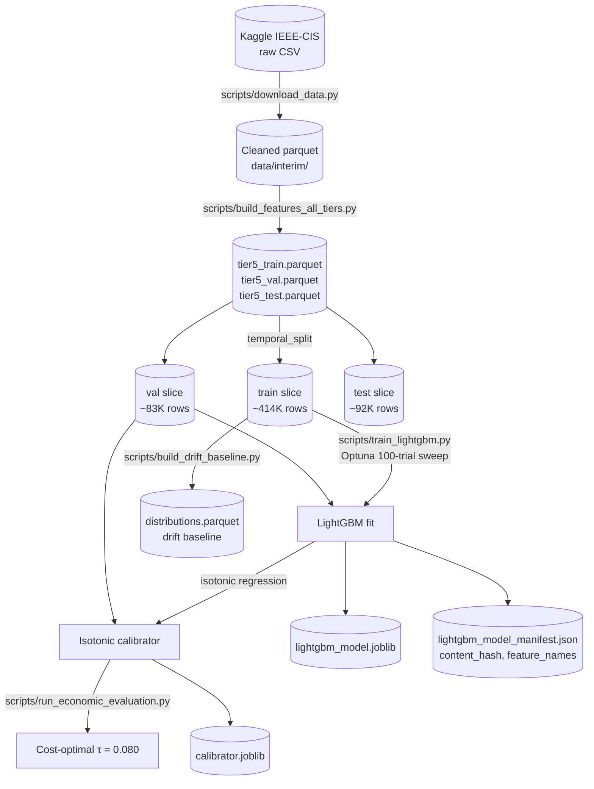
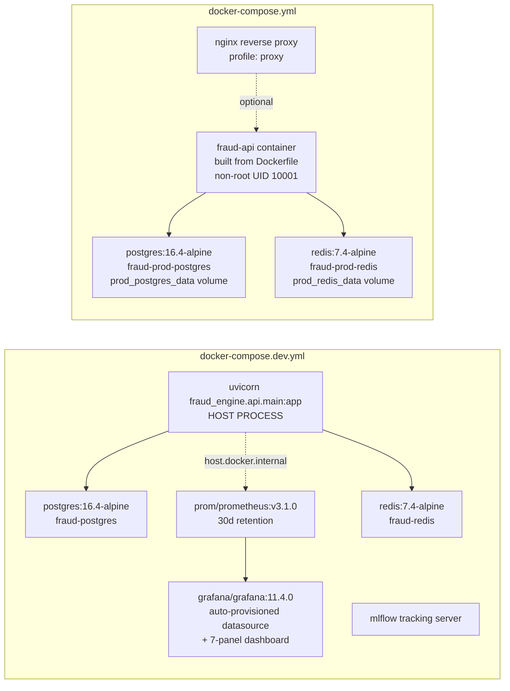

# Architecture

> Companion to [`docs/MODEL_CARD.md`](MODEL_CARD.md), [`docs/FEATURE_DOCUMENTATION.md`](FEATURE_DOCUMENTATION.md), [`docs/RUNBOOK.md`](RUNBOOK.md), and the ADRs under [`docs/ADR/`](ADR/). This doc tells a reviewer how the components fit together, how data flows through them, and what gets deployed where. Reading order: System → Data flow → Deployment → Component reference.

## Overview

The fraud-detection-engine is a real-time per-transaction scoring system serving calibrated fraud probabilities + SHAP-derived top reasons under a 100 ms P95 latency budget (CLAUDE.md §3). The architecture is shaped by **four design constraints**:

1. **Latency** — sub-100ms P95 end-to-end on the `/predict` route. Drives in-process LightGBM inference, Redis online feature store, and the fire-and-forget pattern for shadow + audit-log paths.
2. **Interpretability** — every prediction carries SHAP-derived top reasons surfacing the features that drove the score. Drives the choice of LightGBM (TreeExplainer-compatible) over deep models for the production path.
3. **Observability** — every request produces structured logs with `request_id` correlation, per-stage Prometheus histograms, and a Postgres audit row. Drives the structlog discipline + Prometheus + Grafana + alert-rules layering (Sprint 6.1.a-e).
4. **Reproducibility** — every artefact (raw data, features, model joblib, calibrator, drift baseline, manifest) is content-addressed by SHA-256 and lineage-tracked via MLflow + JSONL streams.

Trade-offs derived from these constraints are recorded in the ADRs ([`docs/ADR/`](ADR/)).

## How to read this doc

- **Three Mermaid diagrams**: system architecture, data flow (training + inference), deployment topology. GitHub renders them inline.
- **Per-diagram prose** explains why the diagram looks the way it does — what each component is, why each arrow exists, what's NOT shown.
- **Diagram vocabulary**:
  - Rectangle = service / module / process.
  - Cylinder = data store.
  - Hexagon = HTTP route / API endpoint.
  - Solid arrow = data / control flow (label: what flows, ≤ 6 words).
  - Dashed arrow = fire-and-forget / non-blocking path.

## System architecture

The runtime topology shows the live serving surface: FastAPI + Redis (online feature store) + Postgres (audit log + batch features) + the monitoring stack (Prometheus + Grafana). MLflow is dev-only (training-time tracking).

```mermaid
flowchart LR
    Client[HTTP Client] -->|POST /predict| API[FastAPI<br/>fraud_engine.api.main]
    API --> FS[FeatureService<br/>5.1.c]
    FS -->|Tier 1 inline| FS
    FS -->|MGET Tier 2,3,4,5| Redis[(Redis<br/>online feature store)]
    FS -->|fallback probe| PG[(Postgres<br/>batch features + audit)]
    API --> Inf[InferenceService<br/>5.1.d]
    Inf --> JL[(lightgbm_model.joblib<br/>+ calibrator.joblib<br/>+ manifest.json)]
    API --> SHAP[ShapExplainer<br/>5.1.e]
    SHAP --> JL
    API -.->|fire-and-forget| Shadow[ShadowService<br/>5.2.b]
    Shadow --> FN[(neural_model.pt<br/>FraudNet challenger)]
    API -.->|fire-and-forget| PL[PredictionLogger<br/>5.2.a]
    PL --> PG
    API --> Metrics[/metrics endpoint]
    Metrics --> Prom[Prometheus<br/>30d retention]
    Prom --> Graf[Grafana<br/>7-panel dashboard]
    Prom -.->|5 alert rules| Alerts[Alert rules<br/>fire on /alerts]
```

**Per-component notes:**

- **`FastAPI` (fraud_engine.api.main)** — module-level `app = create_app()` plus a factory for test-side overrides. Routes: `/health` (liveness), `/ready` (readiness with per-source diagnostics), `/predict` (the hot path), `/metrics` (Prometheus scrape). Middleware binds `X-Request-Id` to a structlog ContextVar so every downstream log line carries the same correlation tag.
- **`FeatureService` (Sprint 5.1.c)** — composes Tier-1 (inline) + Tier 2/3/4/5 (Redis-backed) features. Per-source `degraded_mode` flag flips on per-request when Redis or Postgres is unreachable; the API returns 200 with `degraded_mode=true` rather than failing. Population-default fallbacks defined in `configs/feature_defaults.yaml`.
- **`InferenceService` (Sprint 5.1.d)** — wraps the LightGBM joblib + isotonic calibrator behind `predict(df) → InferenceResult`. Atomic-swap `_Artefacts` frozen dataclass lets `reload()` swap the model artefact bundle mid-session without dropping in-flight requests (used by future `POST /admin/reload-model`, deferred).
- **`ShapExplainer` (Sprint 5.1.e)** — `shap.TreeExplainer` on the booster plus `reason_codes.yaml` mapping shap features to human-readable strings. Returns top-k contributions (k=10).
- **`ShadowService` (Sprint 5.2.b)** — only loaded when `Settings.shadow_enabled=True`. Fire-and-forget `asyncio.create_task` per /predict; wrapped in a 3-state circuit breaker (see [ADR-0004](ADR/0004-shadow-mode.md)).
- **`PredictionLogger` (Sprint 5.2.a)** — async fire-and-forget writes to Postgres `predictions` table for audit. Drained with timeout on lifespan shutdown.
- **`Redis`** — online feature store. Per-feature TTL configured in `configs/redis_feature_store.yaml`. MGET is the load-bearing read pattern (one round-trip across all needed keys).
- **`Postgres`** — `predictions` audit table (Sprint 5.2.a) + batch feature fallback when Redis is unreachable.
- **`Prometheus` + `Grafana`** — Sprint 6.1.a-d. 13 custom metrics + 5 alert rules + 7-panel dashboard. 30-day retention (`--storage.tsdb.retention.time=30d` on the Prometheus container).
- **`MLflow`** (not shown — dev-only) — Sprint 0+3 experiment tracking. Reads training runs from `mlruns/`; not in the production request path.

**What's NOT shown:**

- The training-time graph computation (offline-batch; see [ADR-0006](ADR/0006-graph-features-batch.md)). The graph is fit once per retraining cycle and persisted into the Redis state by `scripts/warmup_redis.py`.
- The diversity batch model (FraudGNN, Model C). It's a training-time feature-generator only; never deployed.
- AlertManager — Sprint 6.1.d ships the alert rules; routing to PagerDuty/Slack is a Sprint 6.x deliverable.

## Data flow

Two flows: training (offline, batch, infrequent) and inference (online, per-request, hot path).

### Training data flow

The training pipeline runs once per retraining cycle (operator-triggered, documented in [`docs/RUNBOOK.md`](RUNBOOK.md#how-to-trigger-retraining)).



**Per-step notes:**

- **Cleaning** — Pandera schema validation at every parquet boundary; row counts logged via `@lineage_step`.
- **5-tier feature engineering** — see [`docs/FEATURE_DOCUMENTATION.md`](FEATURE_DOCUMENTATION.md) for the full per-tier rationale. The 685-feature manifest is written alongside the train parquet.
- **`temporal_split`** — see [ADR-0002](ADR/0002-temporal-split.md). No random splitting anywhere.
- **LightGBM fit + Optuna sweep** — 100 trials by default; `--skip-tuning` reuses `configs/model_best_params.yaml` for faster iteration.
- **Isotonic calibration** — won a 80/20 holdout vs Platt (see [`sprints/sprint_3/prompt_3_3_d_report.md`](../sprints/sprint_3/prompt_3_3_d_report.md)). Brier improved from 0.0769 to 0.0254 on val.
- **Economic threshold optimisation** — see [ADR-0003](ADR/0003-economic-threshold.md). Outputs `τ = 0.080` for `Settings.decision_threshold`.
- **Drift baseline build** — [`scripts/build_drift_baseline.py`](../scripts/build_drift_baseline.py) (Sprint 6.1.b) writes `data/baselines/distributions.parquet` with per-feature quantile edges. Refreshed every retrain.

### Inference data flow

The inference pipeline runs per `/predict` HTTP request. Latency budget: 100 ms P95 (CLAUDE.md §3); observed: 70.98 ms (Sprint 5.1.f).

```mermaid
flowchart TB
    Req[HTTP POST /predict] -->|TransactionRequest JSON| MW[X-Request-Id<br/>middleware]
    MW -->|bind request_id| Route[/predict route<br/>fraud_engine.api.main]
    Route --> Feat[FeatureService.get_features]
    Feat -->|Tier 1 inline| Feat1[Tier-1 features<br/>amount, time, email]
    Feat -->|Redis MGET| Feat2[Tier 2-5 features<br/>velocity, EWM, behavioural, graph]
    Feat --> Inference[InferenceService.predict]
    Inference -->|LightGBM predict_proba| Cal[isotonic calibrator]
    Cal -->|score >= 0.080?| Decision[block / allow]
    Inference --> Shap[ShapExplainer.top_k_contributions]
    Shap --> Resp[PredictionResponse<br/>score, decision, top_reasons,<br/>model_version, latency_ms,<br/>degraded_mode]
    Resp -.->|fire-and-forget| Shadow[ShadowService.score<br/>FraudNet challenger]
    Resp -.->|fire-and-forget| Logger[PredictionLogger.log<br/>Postgres insert]
    Resp --> Out[HTTP 200<br/>PredictionResponse JSON]
```

**Per-step notes:**

- **Middleware** — binds `X-Request-Id` (or generates UUID4) to the structlog ContextVar; echoes the canonical hex form on the response header. Parse-then-fallback-to-UUID4 handles malformed inbound headers.
- **Tier-1 inline** — purely per-row arithmetic (log_amount, hour_of_day, email-domain parsing). ~1 ms wall.
- **Redis MGET** — Tier 2/3/4/5 features fetched in one round-trip across all entity keys. Per-source `degraded_mode` flag flips if Redis unreachable; FeatureService falls back to population defaults. ~50 ms wall on first-call cold-pool; ~15 ms steady-state.
- **LightGBM predict_proba** — synchronous, in-loop (~1-2 ms). Returns shape (1, 2); column 1 is the fraud probability.
- **Isotonic calibration** — single dict lookup on the pre-fit calibrator. <0.1 ms.
- **Decision** — `block` iff `score ≥ Settings.decision_threshold` (0.080).
- **SHAP** — TreeExplainer top-k. ~5-10 ms.
- **Response** — assembled + returned synchronously. The shadow + audit-log paths fire AFTER the response is built; they don't block the response.

## Deployment

Two compose stacks. Operators choose between them based on intent:



**Stack comparison:**

| Concern | `docker-compose.dev.yml` | `docker-compose.yml` |
|---|---|---|
| **Intent** | Local dev + iteration | Production-like smoke before deploy |
| **API location** | Host process (`make serve`) | Containerised |
| **Monitoring** | Full stack (MLflow + Prometheus + Grafana) | None (rely on operator infra) |
| **Volumes** | `prometheus_data`, `grafana_data`, etc. | `prod_postgres_data`, `prod_redis_data` (`prod_` prefix) |
| **Container names** | `fraud-postgres`, `fraud-redis`, etc. | `fraud-prod-postgres`, `fraud-prod-redis`, etc. |
| **Network** | extra_hosts: host.docker.internal | Standard compose network; service-name DNS |
| **Prometheus scrape target** | `host.docker.internal:8000` | `fraud-api:8000` (in-network) |
| **Use case** | Daily development | Release validation |

Both stacks bind to ports 5432 / 6379 (and prod-like adds 8000), so **only one can run at a time**. Stop one before starting the other (`make docker-down`).

**The `prometheus.yml` config** ([`configs/prometheus/prometheus.yml`](../configs/prometheus/prometheus.yml)) carries both scrape targets in one job (`host.docker.internal:8000` labelled `stack=dev` + `fraud-api:8000` labelled `stack=prod`). The unreachable target reads DOWN on `/targets`; alert rules aggregate via `sum`/`rate` across instances so a steady-state DOWN doesn't affect the alert math.

## Component reference

| Component | Source file | Sprint |
|---|---|---|
| HTTP routes + lifespan | [`src/fraud_engine/api/main.py`](../src/fraud_engine/api/main.py) | 5.1.f |
| Request/response schemas | [`src/fraud_engine/api/schemas.py`](../src/fraud_engine/api/schemas.py) | 5.1.a |
| Redis online store | [`src/fraud_engine/api/redis_store.py`](../src/fraud_engine/api/redis_store.py) | 5.1.b |
| Feature composition | [`src/fraud_engine/api/feature_service.py`](../src/fraud_engine/api/feature_service.py) | 5.1.c |
| Inference + calibration | [`src/fraud_engine/api/inference.py`](../src/fraud_engine/api/inference.py) | 5.1.d |
| SHAP top-k | [`src/fraud_engine/api/shap_explainer.py`](../src/fraud_engine/api/shap_explainer.py) | 5.1.e |
| Prediction audit log | [`src/fraud_engine/api/prediction_logger.py`](../src/fraud_engine/api/prediction_logger.py) | 5.2.a |
| Shadow service | [`src/fraud_engine/api/shadow.py`](../src/fraud_engine/api/shadow.py) | 5.2.b |
| Circuit breaker | [`src/fraud_engine/api/circuit_breaker.py`](../src/fraud_engine/api/circuit_breaker.py) | 5.2.b |
| Prometheus metrics | [`src/fraud_engine/monitoring/prometheus_metrics.py`](../src/fraud_engine/monitoring/prometheus_metrics.py) | 6.1.a + 6.1.d |
| Drift monitor | [`src/fraud_engine/monitoring/drift.py`](../src/fraud_engine/monitoring/drift.py) | 6.1.b |
| Performance monitor | [`src/fraud_engine/monitoring/performance_monitor.py`](../src/fraud_engine/monitoring/performance_monitor.py) | 6.1.c |
| Feature pipeline (T1-T5) | [`src/fraud_engine/features/`](../src/fraud_engine/features/) | 2 + 3 |
| Economic cost model | [`src/fraud_engine/evaluation/economic.py`](../src/fraud_engine/evaluation/economic.py) | 4.1 |
| Stratified evaluator | [`src/fraud_engine/evaluation/stratified.py`](../src/fraud_engine/evaluation/stratified.py) | 4.2 |
| Temporal split | [`src/fraud_engine/data/splits.py`](../src/fraud_engine/data/splits.py) | 1 |
| Lineage logging | [`src/fraud_engine/data/lineage.py`](../src/fraud_engine/data/lineage.py) | 1 |
| Pydantic Settings | [`src/fraud_engine/config/settings.py`](../src/fraud_engine/config/settings.py) | 0 |
| Structlog setup | [`src/fraud_engine/utils/logging.py`](../src/fraud_engine/utils/logging.py) | 0 |
| Compose (dev) | [`docker-compose.dev.yml`](../docker-compose.dev.yml) | 0 + 6.1.d |
| Compose (prod-like) | [`docker-compose.yml`](../docker-compose.yml) | 5.1.g |
| Dockerfile | [`Dockerfile`](../Dockerfile) | 5.1.g |
| Prometheus config | [`configs/prometheus/prometheus.yml`](../configs/prometheus/prometheus.yml) | 0 + 6.1.d |
| Alert rules | [`configs/alerts/alert_rules.yml`](../configs/alerts/alert_rules.yml) | 6.1.d |
| Grafana dashboard | [`configs/grafana/fraud_dashboard.json`](../configs/grafana/fraud_dashboard.json) | 6.1.d |

## Cross-references

- [`docs/MODEL_CARD.md`](MODEL_CARD.md) — model details, intended use, metrics, ethical considerations.
- [`docs/FEATURE_DOCUMENTATION.md`](FEATURE_DOCUMENTATION.md) — per-tier + per-generator feature reference.
- [`docs/RUNBOOK.md`](RUNBOOK.md) — per-alert remediation + model rollback + retraining procedures.
- [`docs/OBSERVABILITY.md`](OBSERVABILITY.md) — logging discipline + jq recipes.
- [`docs/DATA_DICTIONARY.md`](DATA_DICTIONARY.md) — raw IEEE-CIS columns.
- [`docs/CONVENTIONS.md`](CONVENTIONS.md) — coding standards.
- [`docs/CONTRIBUTING.md`](CONTRIBUTING.md) — branching + PR conventions.
- **ADRs:**
  - [ADR-0001 — Tech stack](ADR/0001-tech-stack.md).
  - [ADR-0002 — Temporal split](ADR/0002-temporal-split.md).
  - [ADR-0003 — Economic threshold](ADR/0003-economic-threshold.md).
  - [ADR-0004 — Shadow mode](ADR/0004-shadow-mode.md).
  - [ADR-0005 — LightGBM as production champion](ADR/0005-lightgbm-as-production.md).
  - [ADR-0006 — Graph features batch](ADR/0006-graph-features-batch.md).
- **Sprint reports:** [`sprints/sprint_0/`](../sprints/sprint_0/) through [`sprints/sprint_6/`](../sprints/sprint_6/).
