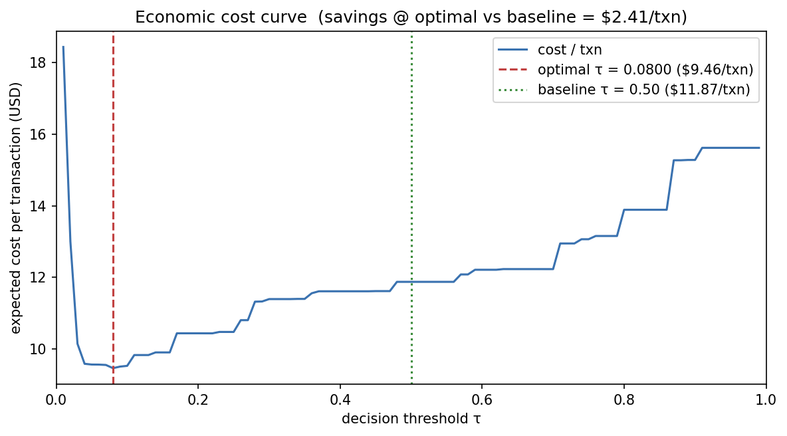
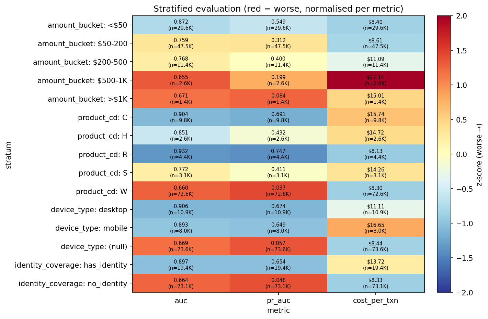

# Economic Evaluation Report — test set

- **Generated by:** `scripts/run_economic_evaluation.py`
- **Date (UTC):** 2026-05-09
- **Test rows:** 92,427
- **Portfolio assumption:** 1,000,000 txns / month

## Acceptance gates

| Gate | Realised | Status |
|---|---|---|
| Optimal τ in [0.3, 0.5] | 0.0800 | ❌ GAP |
| Annual savings ≥ $500,000 | $28,957,772.08 | ✅ PASS |
| Sensitivity spread < 0.2 | 0.0600 | ✅ PASS |

## Optimal threshold

- **Cost-optimal τ:** `0.0800`
- **Baseline τ (placeholder this script replaces):** `0.50`
- **Per-txn cost at optimal:** $9.46
- **Per-txn cost at baseline:** $11.87
- **Per-txn savings (baseline - optimal):** $2.41  (20.3 %)

## Annual savings estimate

| Quantity | Value |
|---|---|
| Cost / txn @ τ_baseline | $11.87 |
| Cost / txn @ τ_optimal  | $9.46 |
| Per-txn savings | $2.41 |
| Monthly portfolio (txns) | 1,000,000 |
| Months per year | 12 |
| **Annual savings** | **$28,957,772.08** |
| Annual cost @ τ_baseline | $142,460,969.20 |
| Annual cost @ τ_optimal | $113,503,197.12 |

Linear extrapolation: per-txn delta × monthly portfolio × 12. Scale linearly for a different portfolio volume.

## Sensitivity to cost variation (±20 %)

Spread of optimal τ across the 125-cell cost grid: `0.0600`. Stability gate: < 0.2 → ✅ PASS.

### Top 5 (lowest τ*)

|   fraud_cost |   fp_cost |   tp_cost |   optimal_threshold |   optimal_total_cost |   optimal_cost_per_txn |
|-------------:|----------:|----------:|--------------------:|---------------------:|-----------------------:|
|     450.0000 |   28.0000 |    6.0000 |              0.0400 |          843142.0000 |                 9.1222 |
|     450.0000 |   28.0000 |    4.0000 |              0.0400 |          839632.0000 |                 9.0843 |
|     450.0000 |   28.0000 |    5.5000 |              0.0400 |          842264.5000 |                 9.1128 |
|     450.0000 |   28.0000 |    4.5000 |              0.0400 |          840509.5000 |                 9.0938 |
|     450.0000 |   28.0000 |    5.0000 |              0.0400 |          841387.0000 |                 9.1033 |

### Bottom 5 (highest τ*)

|   fraud_cost |   fp_cost |   tp_cost |   optimal_threshold |   optimal_total_cost |   optimal_cost_per_txn |
|-------------:|----------:|----------:|--------------------:|---------------------:|-----------------------:|
|     360.0000 |   42.0000 |    5.0000 |              0.1000 |          740857.0000 |                 8.0156 |
|     405.0000 |   38.5000 |    4.5000 |              0.1000 |          809796.5000 |                 8.7615 |
|     360.0000 |   42.0000 |    4.5000 |              0.1000 |          740122.5000 |                 8.0076 |
|     360.0000 |   42.0000 |    4.0000 |              0.1000 |          739388.0000 |                 7.9997 |
|     360.0000 |   38.5000 |    6.0000 |              0.1000 |          733520.0000 |                 7.9362 |

## Stratified performance

Per-segment AUC / PR-AUC / cost on the test set, evaluated at τ = 0.0800 (the cost-optimal value derived above). Month axis intentionally skipped; see Caveats.

| stratum_axis      | stratum_value   |   n_rows |   n_pos |   fraud_rate |    auc |   pr_auc |   total_cost |   cost_per_txn |
|:------------------|:----------------|---------:|--------:|-------------:|-------:|---------:|-------------:|---------------:|
| amount_bucket     | <$50            |    29578 |    1274 |       0.0431 | 0.8722 |   0.5490 |  248465.0000 |         8.4003 |
| amount_bucket     | $50-200         |    47486 |    1298 |       0.0273 | 0.7590 |   0.3116 |  408630.0000 |         8.6053 |
| amount_bucket     | $200-500        |    11412 |     420 |       0.0368 | 0.7676 |   0.3996 |  126520.0000 |        11.0866 |
| amount_bucket     | $500-1K         |     2582 |     176 |       0.0682 | 0.6549 |   0.1994 |   70070.0000 |        27.1379 |
| amount_bucket     | >$1K            |     1369 |      45 |       0.0329 | 0.6715 |   0.0844 |   20545.0000 |        15.0073 |
| product_cd        | C               |     9757 |    1320 |       0.1353 | 0.9044 |   0.6911 |  153605.0000 |        15.7431 |
| product_cd        | H               |     2647 |     170 |       0.0642 | 0.8510 |   0.4320 |   38970.0000 |        14.7223 |
| product_cd        | R               |     4358 |     221 |       0.0507 | 0.9319 |   0.7472 |   35440.0000 |         8.1322 |
| product_cd        | S               |     3062 |     165 |       0.0539 | 0.7717 |   0.4111 |   43675.0000 |        14.2636 |
| product_cd        | W               |    72603 |    1337 |       0.0184 | 0.6600 |   0.0372 |  602540.0000 |         8.2991 |
| device_type       | desktop         |    10906 |     852 |       0.0781 | 0.9055 |   0.6738 |  121125.0000 |        11.1063 |
| device_type       | mobile          |     7960 |     960 |       0.1206 | 0.8925 |   0.6487 |  132550.0000 |        16.6520 |
| device_type       | (null)          |    73561 |    1401 |       0.0190 | 0.6690 |   0.0569 |  620555.0000 |         8.4359 |
| identity_coverage | has_identity    |    19363 |    1849 |       0.0955 | 0.8973 |   0.6535 |  265725.0000 |        13.7233 |
| identity_coverage | no_identity     |    73064 |    1364 |       0.0187 | 0.6635 |   0.0484 |  608505.0000 |         8.3284 |

## Figures

### Cost curve

### Stratified heatmap

## `.env` update

- `DECISION_THRESHOLD` updated `0.50` → `0.080000` in `/home/dchit/projects/fraud-detection-engine/.env` on 2026-05-09.
- Backup: `/home/dchit/projects/fraud-detection-engine/.env.bak`.
- To roll back: `mv .env.bak .env`.

## Caveats

- **Cost values are industry medians** per CLAUDE.md §8 + `configs/economic_defaults.yaml`. The ±20 % sensitivity grid above bounds the impact, but a deployer with materially different cost economics MUST override `.env` and re-run this script.
- **Test set is one temporal snapshot.** Production drift is not measured here; that's Sprint 6 monitoring territory. The chosen τ assumes the test-set fraud profile holds in production.
- **Portfolio default is 1,000,000 txns / month.** Annual savings scale linearly for a different volume; the report carries the per-txn delta separately so a reader can re-do the arithmetic.
- **Calibration is the load-bearing dependency** (ADR 0003). A calibration regression invalidates this τ; Sprint 3.3.c's isotonic calibrator must remain accurate for the cost surface to be faithful.
- **Per-segment thresholds may yield additional savings** beyond the global τ. The stratified heatmap above visualises per-stratum skew; per-segment optimisation is Sprint 5+ territory.
- **Month axis intentionally skipped** — Tier-5 parquet drops `timestamp` (`build_features_all_tiers.py:110-111`) and the test set is approximately one calendar month, so within-test month stratification is degenerate. Cross-month drift is Sprint 6 monitoring territory.
- **Savings are computed against τ = 0.5** (the placeholder this script replaces), NOT against "no model at all." Model value vs threshold-optimisation value are different questions; this report answers the latter.

## Artefacts

- This report: `/home/dchit/projects/fraud-detection-engine/reports/economic_evaluation.md`
- Cost curve: `/home/dchit/projects/fraud-detection-engine/reports/figures/economic_cost_curve.png`
- Stratified heatmap: `/home/dchit/projects/fraud-detection-engine/reports/figures/economic_stratified_heatmap.png`
- `.env` (updated): `/home/dchit/projects/fraud-detection-engine/.env`
- `.env.bak` (rollback): `/home/dchit/projects/fraud-detection-engine/.env.bak`
- Model A: `models/sprint3/lightgbm_model.joblib` (produced by `scripts/train_lightgbm.py`)
- Calibrator: `models/sprint3/calibrator.joblib` (produced by `scripts/train_lightgbm.py` via `select_calibration_method`)

## References

- `CLAUDE.md` §8 — Business-Logic Constants (cost defaults).
- `configs/economic_defaults.yaml` — cost provenance.
- `docs/ADR/0003-economic-threshold.md` — cost-based τ over F1 / AUC.
- `src/fraud_engine/evaluation/economic.py` — `EconomicCostModel` (Sprint 4.1).
- `src/fraud_engine/evaluation/stratified.py` — `StratifiedEvaluator` (Sprint 4.2).
- `sprints/sprint_4/prompt_4_1_report.md`, `prompt_4_2_report.md`, `prompt_4_3_report.md` — Sprint 4 build-up.
- `reports/model_a_training_report.md` — Model A's training report (Sprint 3.3.d).
