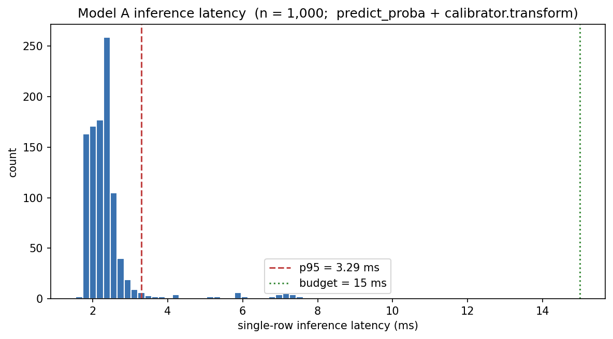

# Model A — LightGBM training report

- **Generated by:** `scripts/train_lightgbm.py`
- **Train rows:** 414,542
- **Val rows:** 83,571
- **Test rows:** 92,427
- **Features:** 743

## Headline metrics

| Metric | Val | Test |
|---|---|---|
| ROC-AUC | 0.8281 | 0.8070 |
| PR-AUC | 0.3814 | 0.4220 |
| Log loss (uncalibrated) | 0.291436 | 0.236990 |
| Log loss (calibrated) | 0.108958 | 0.111821 |
| Brier (uncalibrated) | 0.076948 | 0.057778 |
| Brier (calibrated) | 0.025365 | 0.024877 |
| ECE (uncalibrated) | 0.192569 | 0.148978 |
| ECE (calibrated) | 0.000000 | 0.007512 |

**Calibration method chosen:** `isotonic`

## Acceptance gates

- ❌ Val AUC ≥ 0.93 (realised: 0.8281)
- ✅ Inference p95 < 15.0 ms (realised: 3.29 ms)
- ✅ Calibration doesn't hurt val log loss (0.108958 vs 0.291436 baseline)

## Inference latency

Single-row `predict_proba → calibrator.transform`, n = 1,000 random rows from val:

| Quantile | Latency (ms) |
|---|---|
| p50 | 2.28 |
| p95 | 3.29 |
| p99 | 7.21 |



## Best Optuna parameters

From `configs/model_best_params.yaml` — best Optuna val AUC: **0.8281** over 100 trials.

```yaml
bagging_fraction: 0.9828324388747637
bagging_freq: 4
feature_fraction: 0.5622415222923086
learning_rate: 0.1199387469787449
max_depth: 3
min_child_samples: 80
num_leaves: 121
reg_alpha: 0.0018427254574054806
reg_lambda: 1.44053877542634e-08
```

## Trial history (top 0)

_(trial history unavailable — see MLflow tuning run for details)_

## Top 50 feature importances (gain)

| Rank | Feature | Gain | Tier / interpretation |
|---|---|---|---|
| 1 | `card1_fraud_v_ewm_lambda_0.05` | 1037305 | Tier-4 EWM fraud-weighted velocity (OOF-safe) |
| 2 | `R_emaildomain_is_free` | 332938 | Tier-1 email-domain feature |
| 3 | `V90` | 274438 | Vesta-engineered V feature |
| 4 | `C1` | 210610 | Vesta-engineered C feature |
| 5 | `pagerank_score` | 167854 | Tier-5 graph-pagerank score |
| 6 | `card1_fraud_v_ewm_lambda_0.5` | 119530 | Tier-4 EWM fraud-weighted velocity (OOF-safe) |
| 7 | `C14` | 99731 | Vesta-engineered C feature |
| 8 | `card1_fraud_v_ewm_lambda_0.1` | 77756 | Tier-4 EWM fraud-weighted velocity (OOF-safe) |
| 9 | `V258` | 58066 | Vesta-engineered V feature |
| 10 | `card1_v_ewm_lambda_0.5` | 48620 | Tier-4 EWM velocity |
| 11 | `V306` | 45077 | Vesta-engineered V feature |
| 12 | `TransactionAmt` | 42612 | Raw transaction column |
| 13 | `D3` | 39908 | Vesta-engineered D feature |
| 14 | `V294` | 34369 | Vesta-engineered V feature |
| 15 | `C6` | 25851 | Vesta-engineered C feature |
| 16 | `DeviceInfo_velocity_24h` | 20969 | Tier-2 per-entity velocity counter |
| 17 | `C13` | 20307 | Vesta-engineered C feature |
| 18 | `V279` | 20306 | Vesta-engineered V feature |
| 19 | `entity_degree_card1` | 16182 | Tier-5 entity degree (training-graph hubness) |
| 20 | `V187` | 16047 | Vesta-engineered V feature |
| 21 | `D2` | 14014 | Vesta-engineered D feature |
| 22 | `card1_velocity_1h` | 13973 | Tier-2 per-entity velocity counter |
| 23 | `V313` | 12896 | Vesta-engineered V feature |
| 24 | `C11` | 12597 | Vesta-engineered C feature |
| 25 | `entity_degree_P_emaildomain` | 12394 | Tier-5 entity degree (training-graph hubness) |
| 26 | `V257` | 12254 | Vesta-engineered V feature |
| 27 | `V243` | 11316 | Vesta-engineered V feature |
| 28 | `V29` | 10752 | Vesta-engineered V feature |
| 29 | `is_null_M5` | 10683 | Tier-1 missingness indicator |
| 30 | `V45` | 10204 | Vesta-engineered V feature |
| 31 | `log_amount` | 10114 | Tier-1 amount transform |
| 32 | `card1_velocity_7d` | 9990 | Tier-2 per-entity velocity counter |
| 33 | `card1_v_ewm_lambda_0.05` | 9982 | Tier-4 EWM velocity |
| 34 | `addr1_target_enc` | 9611 | Tier-2 OOF target encoding |
| 35 | `DeviceInfo_fraud_v_ewm_lambda_0.5` | 9546 | Tier-4 EWM fraud-weighted velocity (OOF-safe) |
| 36 | `V69` | 9537 | Vesta-engineered V feature |
| 37 | `P_emaildomain_target_enc` | 9260 | Tier-2 OOF target encoding |
| 38 | `C5` | 9209 | Vesta-engineered C feature |
| 39 | `card1_v_ewm_lambda_0.1` | 9207 | Tier-4 EWM velocity |
| 40 | `is_null_M4` | 9000 | Tier-1 missingness indicator |
| 41 | `addr1_fraud_v_ewm_lambda_0.5` | 8144 | Tier-4 EWM fraud-weighted velocity (OOF-safe) |
| 42 | `D8` | 7216 | Vesta-engineered D feature |
| 43 | `V201` | 6713 | Vesta-engineered V feature |
| 44 | `D1` | 6583 | Vesta-engineered D feature |
| 45 | `DeviceInfo_v_ewm_lambda_0.5` | 6418 | Tier-4 EWM velocity |
| 46 | `V133` | 5783 | Vesta-engineered V feature |
| 47 | `V314` | 5485 | Vesta-engineered V feature |
| 48 | `V307` | 5422 | Vesta-engineered V feature |
| 49 | `V54` | 5391 | Vesta-engineered V feature |
| 50 | `V312` | 5319 | Vesta-engineered V feature |

## Artifacts

- Model: `/home/dchit/projects/fraud-detection-engine/models/sprint3/lightgbm_model.joblib`
- Calibrator: `/home/dchit/projects/fraud-detection-engine/models/sprint3/calibrator.joblib`
- This report: `/home/dchit/projects/fraud-detection-engine/reports/model_a_training_report.md`
- Latency histogram: `/home/dchit/projects/fraud-detection-engine/reports/figures/model_a_latency.png`
