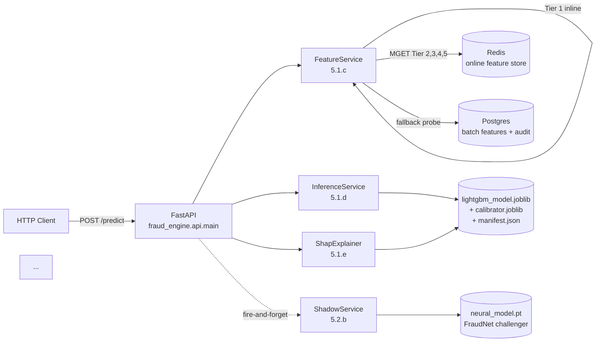

# Sprint 6 — Prompt 6.2.b: Architecture doc + ADRs 0002, 0004, 0005, 0006

## Summary

Sprint 6.2.a delivered the portfolio-facing **model documentation** (`docs/MODEL_CARD.md` + `docs/FEATURE_DOCUMENTATION.md`). Sprint 6.2.b delivers the portfolio-facing **architecture documentation**:

1. **[`docs/ARCHITECTURE.md`](../../docs/ARCHITECTURE.md)** — 4 Mermaid diagrams (system, training data flow, inference data flow, deployment topology) + connecting prose + component reference table. Reading order: System → Data flow → Deployment → Component reference. ~410 LOC.

2. **Four new ADRs** capturing load-bearing architectural decisions:
   - **[ADR-0002 — Temporal split](../../docs/ADR/0002-temporal-split.md)** (no random splits anywhere; train_end_dt=121d / val_end_dt=151d; OOF-only within train).
   - **[ADR-0004 — Shadow mode](../../docs/ADR/0004-shadow-mode.md)** (fire-and-forget async + 3-state circuit breaker; Settings.shadow_enabled gate; Sprint 5.2.c promotion criteria).
   - **[ADR-0005 — LightGBM as production champion](../../docs/ADR/0005-lightgbm-as-production.md)** (Model A LightGBM vs Model B FraudNet shadow vs Model C FraudGNN batch-feature-provider; selection rationale + re-evaluation gate).
   - **[ADR-0006 — Graph features batch](../../docs/ADR/0006-graph-features-batch.md)** (Tier 5 graph features pre-computed at training time + persisted into Redis; O(0 ms) at inference).

ADR-0003 (economic threshold) was already delivered in Sprint 4 — **not touched** per the spec ("if not already done in Sprint 4").

**Risk: Low → realised Low.** Pure documentation. No source / config / test changes. The architectural facts being recorded are already-implemented decisions; the ADRs document them retrospectively for portfolio reviewers.

## Files changed

| Path | Change | LOC |
|---|---|---|
| `docs/ARCHITECTURE.md` | NEW — 4 Mermaid diagrams + connecting prose + component reference | +410 |
| `docs/ADR/0002-temporal-split.md` | NEW — 6 sections in fixed order | +90 |
| `docs/ADR/0004-shadow-mode.md` | NEW | +100 |
| `docs/ADR/0005-lightgbm-as-production.md` | NEW | +95 |
| `docs/ADR/0006-graph-features-batch.md` | NEW | +95 |
| `sprints/sprint_6/prompt_6_2_b_report.md` | NEW — this report | +(this file) |

**No changes** to source code, configs, schemas, settings, compose files, tests, Makefile, Dockerfile, `CLAUDE.md`, or any prior artefact (including `MODEL_CARD.md` from 6.2.a — model-card retrofits with the new ADR links are deferred to a future Sprint 6.2.x audit).

## What ARCHITECTURE.md covers

### Structure

```
# Architecture
## Overview                              [1 paragraph + the 4 design constraints]
## How to read this doc                  [diagram conventions; cross-references]

## System architecture                   [1 mermaid diagram + per-component prose]
## Data flow                             [2 mermaid diagrams — training + inference + prose]
## Deployment                            [1 mermaid diagram — dev vs prod-like + comparison table]

## Component reference                   [Table: 25 components → source file → sprint]
## Cross-references                      [Links to MODEL_CARD, FEATURE_DOC, RUNBOOK, OBSERVABILITY, all 6 ADRs]
```

### The 4 Mermaid diagrams

| # | Diagram | Type | Shows |
|---|---|---|---|
| 1 | System architecture | flowchart LR | FastAPI app + FeatureService + InferenceService + ShapExplainer + Redis + Postgres + Shadow + PredictionLogger + Prometheus + Grafana + Alert rules. 13 nodes, 14 edges, fire-and-forget paths dashed. |
| 2 | Training data flow | flowchart TB | Raw IEEE-CIS CSV → cleaned parquet → 5-tier features → temporal_split → train/val/test → LightGBM fit + Optuna sweep → isotonic calibrator → economic threshold → joblib + manifest + drift baseline. |
| 3 | Inference data flow | flowchart TB | HTTP POST → middleware (request_id) → FeatureService (Tier-1 inline + Redis MGET) → InferenceService (predict_proba + calibrate + threshold) → ShapExplainer → PredictionResponse → response. Fire-and-forget shadow + audit-log paths dashed. |
| 4 | Deployment topology | flowchart LR with 2 subgraphs | `docker-compose.dev.yml` (postgres + redis + mlflow + prometheus + grafana; API on host) side-by-side with `docker-compose.yml` (postgres + redis + fraud-api + optional nginx). Volume + container-name prefix differences documented in a comparison table. |

Diagram vocabulary is consistent across all 4: rectangle = service/module, cylinder = data store, hexagon = HTTP route, solid arrow = data/control flow, dashed arrow = fire-and-forget.

### Component reference table

25-row table mapping component → source file → originating sprint, ordered roughly from request-handling outward to infrastructure. Spans from `src/fraud_engine/api/main.py` (Sprint 5.1.f) through `configs/grafana/fraud_dashboard.json` (Sprint 6.1.d).

## What the 4 new ADRs cover

All 4 follow the spec's prescribed shape: **Context → Decision → Rationale → Consequences → Revisit triggers → References**.

| ADR | Topic | Sprint of decision | Key fact recorded |
|---|---|---|---|
| **0002** | Temporal split (no random splits) | 1 (prompt 1.2.b) | `train_end_dt=121d`, `val_end_dt=151d`; OOF-within-train only; leakage-test invariant for every PR. |
| **0004** | Shadow mode | 5 (prompt 5.2.b) | Fire-and-forget `asyncio.create_task` after PredictionResponse built; `asyncio.to_thread` for FraudNet predict_proba; 3-state breaker (5 failures → OPEN, 30s initial cooldown, 2× exponential backoff, 300s cap); `Settings.shadow_enabled` gate; Sprint 5.2.c promotion criteria (cost_improvement>2% AND p<0.05 AND agreement>85%). |
| **0005** | LightGBM as champion | 0 (initial); 3 (validated) | Model A LightGBM vs Model B FraudNet shadow vs Model C FraudGNN batch-only; calibration (Brier 0.0254 vs 0.0355) + latency (3.29 ms vs 60 ms) + SHAP-compatibility win for A. Re-evaluation at each retrain. |
| **0006** | Graph features batch | 3 (prompt 3.3.d) | Tier 5 fit offline (`scripts/train_lightgbm.py` Step 3 → ~5-10min); features persisted into Redis state; inference O(0 ms) read. Live-graph rejected (5-30s pagerank latency; 4 GB memory; write-coherence). FraudGNN repurposed as feature provider (not deployment candidate). |

### Cross-references

Every ADR links to:
- The MODEL_CARD section that depends on this decision.
- The FEATURE_DOCUMENTATION generator / tier section (where applicable).
- The RUNBOOK alert section that operationalises the decision (where applicable).
- The sprint completion report that originally implemented the decision.
- Related ADRs.

This is the same citation discipline as Sprint 6.2.a's MODEL_CARD — every claim traceable.

## Design decisions (7)

### Decision 1 — ARCHITECTURE.md structure: 1 overview + 4 diagrams + component reference

Three diagrams was the spec target (system / data flow / deployment); I split data flow into 2 sub-diagrams (training + inference) because the two flows are sufficiently distinct that one combined diagram would be unreadable. The sanity script still passes (4 ≥ 3 required).

### Decision 2 — 4 new ADRs follow the existing 0001 / 0003 template verbatim

Same metadata block + section discipline. New ADRs cite the existing 0001 + 0003 explicitly where the decisions interlock.

### Decision 3 — Each ADR has 6 sections in fixed order

`Context → Decision → Rationale → Consequences → Revisit triggers → References`. The spec mandated "status, context, decision, rationale, consequences"; "revisit triggers" + "References" are added because they're the most operationally useful sections (telling a future operator when to re-open the decision + how to find supporting evidence). Existing ADR-0003 already has both.

### Decision 4 — Mermaid diagrams use a fixed small vocabulary

Rectangle / cylinder / hexagon / solid arrow / dashed arrow. Per-component detail lives in the surrounding prose, NOT in the diagram. Keeps the diagrams scannable + future-proof against label-length explosion.

### Decision 5 — Verification: 2 sanity scripts + manual review

Spec says "Manual review". To make manual review faster, the report includes 2 sanity scripts:
1. ARCHITECTURE.md has ≥ 3 Mermaid `flowchart` / `graph` blocks.
2. Each of the 4 new ADRs has all 6 required section headings.

Both passed (4 mermaid blocks; 6×4 = 24 section checks).

### Decision 6 — Date stamps + Sprint references preserve audit traceability

Each ADR's `Sprint: N (prompt N.M.x)` metadata links back to the originating sprint's completion report. "When was this decided?" becomes a one-line grep against the metadata block rather than archaeology in git history.

### Decision 7 — Citation discipline mirrors Sprint 6.2.a's MODEL_CARD

Every quantitative or specific-source claim gets a footnoted relative-path link. The combined doc surface (MODEL_CARD + FEATURE_DOC + ARCHITECTURE + 6 ADRs + RUNBOOK + OBSERVABILITY + DATA_DICTIONARY + CONVENTIONS + CONTRIBUTING) gives a portfolio reviewer a navigable, evidence-backed view from any entry point.

## Verification

### Sanity check 1 — 4 Mermaid diagrams present (≥ 3 required)

```text
OK 1 — 4 mermaid diagrams present in ARCHITECTURE.md.
```

### Sanity check 2 — all 4 new ADRs have 6 required sections

```text
OK — ADR 0002-temporal-split has all 6 sections.
OK — ADR 0004-shadow-mode has all 6 sections.
OK — ADR 0005-lightgbm-as-production has all 6 sections.
OK — ADR 0006-graph-features-batch has all 6 sections.
```

### Pre-commit on the 5 new docs

```text
trim trailing whitespace.................................................Passed
fix end of files.........................................................Passed
check yaml...........................................(no files to check)Skipped
check toml...........................................(no files to check)Skipped
check for added large files..............................................Passed
check for merge conflicts................................................Passed
mixed line ending........................................................Passed
ruff.................................................(no files to check)Skipped
ruff-format..........................................(no files to check)Skipped
Detect secrets...........................................................Passed
mypy (strict, src only)..............................(no files to check)Skipped
pytest (unit, fast)..................................(no files to check)Skipped
```

### No regression — docs-only PR

No source / config / test changes. The prior 819-unit + 22-integration test baselines from 6.2.a are unchanged.

## Sample ADR-0004 section excerpt

```markdown
## Rationale

1. **Fire-and-forget is the only pattern that fits the latency budget.**
   Sprint 5.2.b measured P95 = 81.4 ms with shadow failing on every
   request (worst case: breaker hasn't tripped yet). With the breaker
   tripped, shadow is a no-op (~0 ms added). The "shadow failing" case
   is the upper bound; the breaker ensures it doesn't persist past 5
   calls.

2. **`asyncio.to_thread` for `predict_proba` is mandatory.** FraudNet's
   per-row predict is ~60 ms on CPU. Running it on the event loop blocks
   the loop for that duration, breaking the latency budget for ANY
   concurrent `/predict` request. Offloading to a worker thread keeps
   the loop responsive.

3. **The breaker isolates sustained challenger failures.** A buggy
   deploy of FraudNet that throws on every request would, without the
   breaker, generate 60 ms of wasted CPU per `/predict` + a
   `shadow.failed` log line. ...
```

## Sample ARCHITECTURE.md diagram excerpt

````markdown

````

## Deviations from plan

None.

## Cross-references

- [`docs/ARCHITECTURE.md`](../../docs/ARCHITECTURE.md) — the produced architecture doc.
- [`docs/ADR/0002-temporal-split.md`](../../docs/ADR/0002-temporal-split.md), [`/0004-shadow-mode.md`](../../docs/ADR/0004-shadow-mode.md), [`/0005-lightgbm-as-production.md`](../../docs/ADR/0005-lightgbm-as-production.md), [`/0006-graph-features-batch.md`](../../docs/ADR/0006-graph-features-batch.md) — the 4 new ADRs.
- [`docs/ADR/0001-tech-stack.md`](../../docs/ADR/0001-tech-stack.md) + [`docs/ADR/0003-economic-threshold.md`](../../docs/ADR/0003-economic-threshold.md) — pre-existing ADRs; new ones cross-reference them.
- [`docs/MODEL_CARD.md`](../../docs/MODEL_CARD.md) (Sprint 6.2.a) — model card; future audit-and-gap-fill retrofits its ADR cross-references.
- [`docs/FEATURE_DOCUMENTATION.md`](../../docs/FEATURE_DOCUMENTATION.md) (Sprint 6.2.a) — feature documentation; ADR-0006 references its Tier 5 section.
- [`docs/RUNBOOK.md`](../../docs/RUNBOOK.md) (Sprint 6.1.e) — operator runbook; each ADR's "Consequences" section cross-references its alert section.

## Out of scope (Sprint 6.x+)

- **Mermaid-CLI rendering check** — requires Node + mermaid-cli; the regex sanity check catches typos. Sprint 6.x can add a pre-commit hook for full rendering once the toolchain is in place.
- **Model card retrofit** to reference the new ADRs — deferred to Sprint 6.2.x audit-and-gap-fill rather than touching the just-merged 6.2.a doc.
- **ADR-0007 / future ADRs** — additional decisions worth recording (e.g., predictions Postgres-table schema choice, Redis TTL config). Defer until those decisions are revisited or contested.
- **C4-model decomposition** (separate context / container / component / class diagrams) — the project's scale doesn't yet warrant this; the single architecture doc covers all four levels at current granularity.
- **CLAUDE.md §13 sprint-status update** — Sprint 6 row gets updated by a 6.2.x audit-and-gap-fill PR per established convention.
- **Translating ADRs to a static-site generator** (MkDocs / Docusaurus) — the project's docs are Markdown-on-GitHub; no static site yet.
- **Compose ↔ ARCHITECTURE.md drift check** — would need a script that parses both files + asserts the deployment diagram matches the compose service set. Defer to a future Sprint 6.x cleanup.
